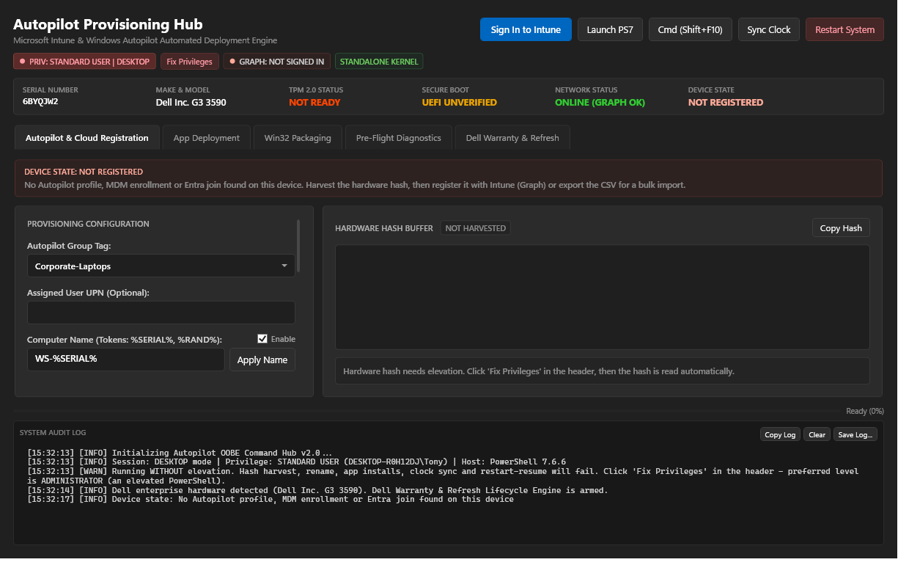
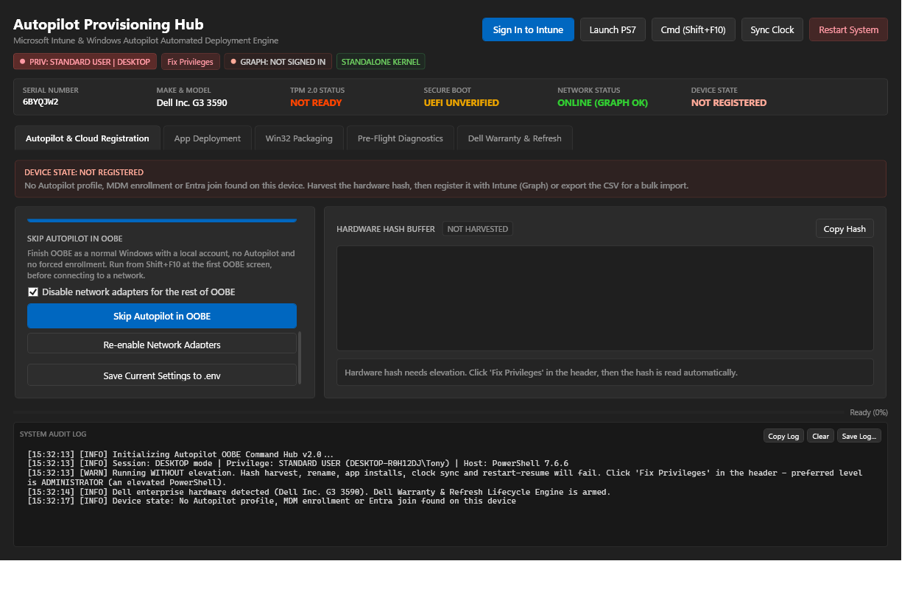
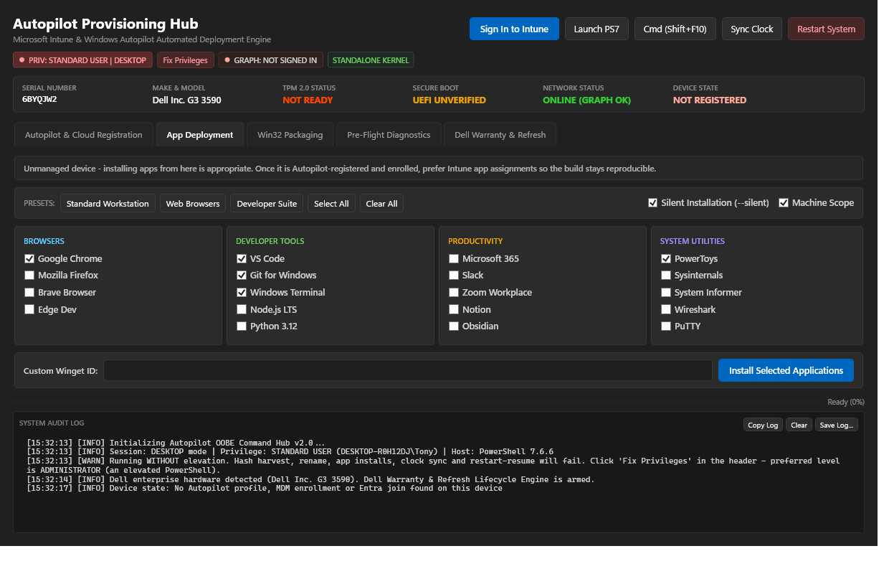
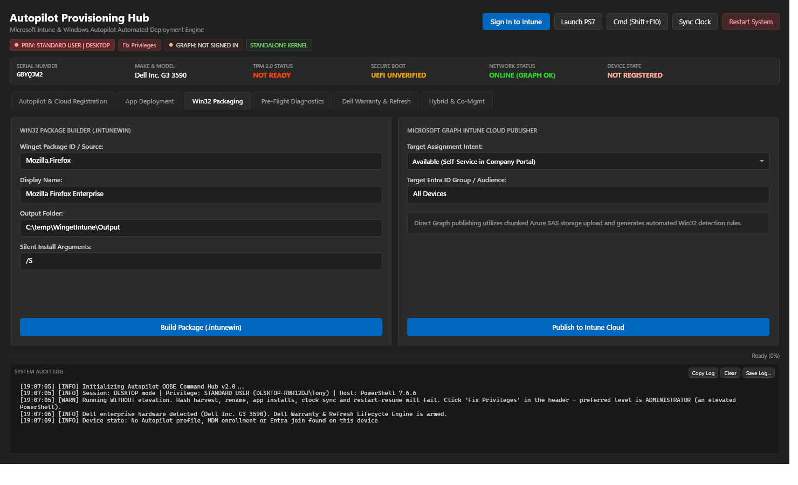
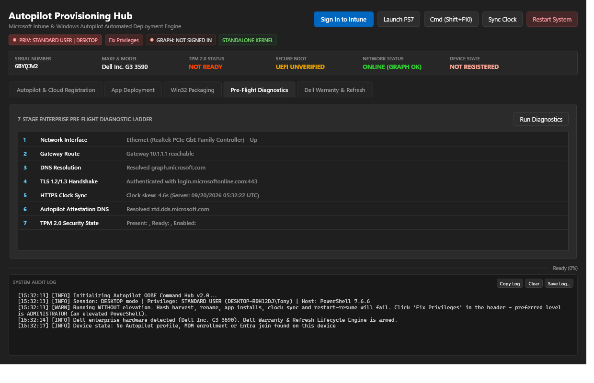
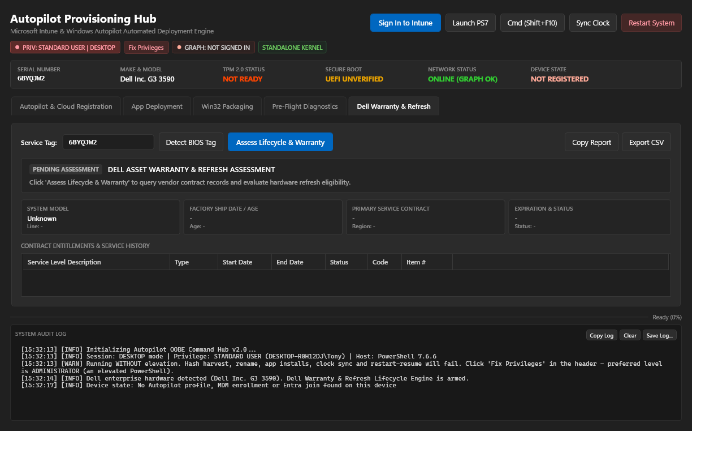
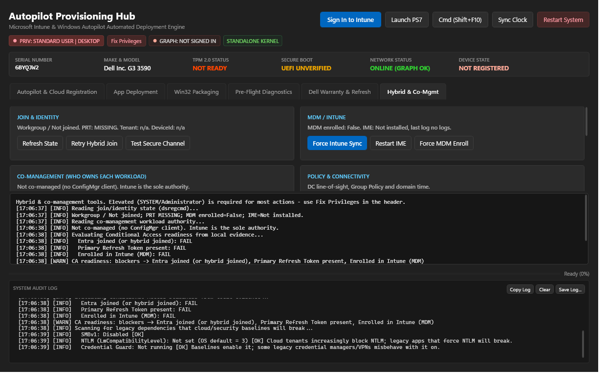
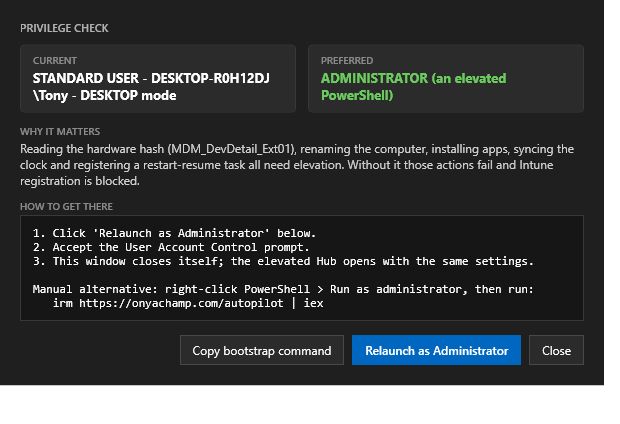
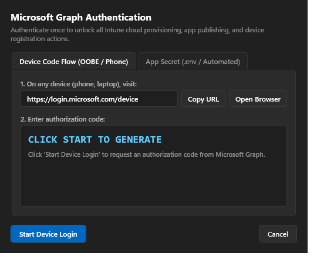
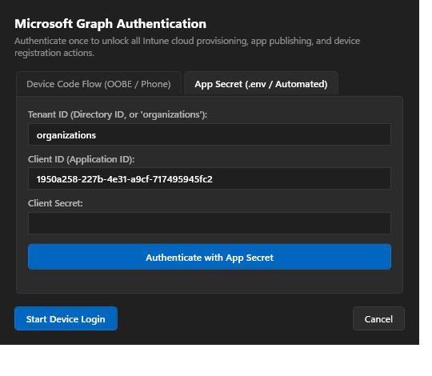

# Autopilot OOBE Command Hub

> **Enterprise Provisioning & Endpoint Deployment Engine for Windows Setup (`Shift` + `F10`)**

[](https://microsoft.com)
[](https://microsoft.com/windows)
[](https://learn.microsoft.com/windows/apps/design/)
[](LICENSE)
[](https://github.com/thebubbsy/AutopilotCommandHub)

---



---

## ⚡ Instant Bootstrapping (OOBE Shift + F10)

During Windows Out-of-Box Experience (OOBE), press `Shift` + `F10` to open Command Prompt, then run:

```powershell
powershell -ExecutionPolicy Bypass -Command "irm https://raw.githubusercontent.com/thebubbsy/AutopilotCommandHub/main/autopilot.ps1 | iex"
```

Or from an existing clone:
```powershell
powershell -ExecutionPolicy Bypass -File "C:\src\AutopilotCommandHub\autopilot.ps1"
```

---

## 📸 Screenshots

### Autopilot & Cloud Registration
Device-state banner (reads cached Autopilot profile, MDM enrollment and Entra join from the machine itself), hardware-hash buffer, group tag / user / rename, and the always-visible privilege badge.


### Skip Autopilot in OOBE
Finish OOBE as a normal local-account Windows - no Autopilot, no forced enrollment. Run from `Shift`+`F10` at the first OOBE screen, before connecting to a network.



### App Deployment
Curated Winget bundles with presets; the advisory adapts to whether the device is Intune-managed.



### Win32 Packaging & Cloud Publishing
Build `.intunewin` packages and publish straight to Intune via chunked Azure SAS upload.



### 7-Stage Pre-Flight Diagnostics
Interface -> Gateway -> DNS -> TLS -> Clock -> Autopilot DNS -> TPM.



### Dell Warranty & Refresh
Service-tag warranty lookup and hardware-refresh verdict via the Dell eAPI.



### Hybrid Azure AD Join & Co-Management
On-device diagnostics and one-click fixes for the things that break in a hybrid (on-prem domain + Entra) co-managed environment: join/PRT state, forced Intune sync, IME health, co-management workload ownership, DC line-of-sight, BitLocker escrow, CA readiness and a helpdesk diagnostics bundle.



### Privilege Check
Current vs. preferred privilege level, why it matters, and a guided elevated relaunch.



### Microsoft Graph / Intune Authentication
One parent sign-in unlocks every cloud action - Device Code Flow for field techs, App Secret for automation.

Device Code Flow | App Secret
:---:|:---:
 | 

---

## 🌟 Executive Overview

**Autopilot OOBE Command Hub** is an all-in-one, standalone technician provisioning console designed for IT administrators and field engineers setting up endpoints. It packages hardware telemetry harvesting, Microsoft Graph cloud registration, batch application installation, Win32 packaging, 7-stage pre-flight diagnostics, and vendor hardware refresh lifecycle auditing into a single, zero-dependency Fluent Dark WPF application.

### Why Autopilot Command Hub?
* **Zero External Dependencies**: Does not require `Microsoft.Graph`, `AzureAD`, or external PowerShell gallery modules. Operates 100% natively in inbox Windows PowerShell 5.1 and modern PowerShell 7+.
* **Native Single-Threaded Apartment (STA) Engine**: Built on a non-blocking `DispatcherFrame` message loop that streams live color-coded logs without freezing the interface.
* **WinUI 3 Fluent Dark Architecture**: Crafted strictly with authentic Windows 11 dark theme design tokens (`#202020` canvas, `#2B2B2B` elevation surfaces, and `#0067C0` accent blue).
* **Cross-Subsystem Core Integration**: Combines core engines from [`AutopilotFast`](https://github.com/thebubbsy/AutopilotFast), [`IntuneShared`](https://github.com/thebubbsy/IntuneShared), and [`WingetIntune`](https://github.com/thebubbsy/WingetIntune).
* **Fast, Non-Blocking Startup**: The window renders in ~3 s (pwsh 7) / ~2.4 s (Windows PowerShell 5.1), down from ~10 s. Slow, UI-free work - the 7-stage network ladder, licensing WMI, TPM probe, battery/storage counters - runs in a background runspace pool and streams into the UI as it completes, so the console never blocks on a probe. Secure Boot is read from its registry mirror (works without elevation) and the OA3 product key is cached per session.
* **A little showmanship**: On launch the console plays a brief ASCII cowboy shootout *while* those background probes run, so the flourish overlaps real work instead of adding to it. It is skipped automatically when there is no console, output is redirected, `-NoIntro` is passed, or `AUTOPILOT_NO_INTRO` is set. Replay it any time with `.utopilot.ps1 -Shootout`. (There are one or two other things to find, too.)

---

## 🚀 Core Functional Hubs

### 1. Autopilot & Cloud Registration
* **High-Speed Hardware Hash Harvester**: Queries WMI `MDM_DevDetail_Ext01` and validates the genuine OA3 blob (magic `4F 41 33 00` = Base64 prefix `T0EzAA`, 2,048–16,384 bytes). The hub never fabricates a hash: if the provider cannot be read (not elevated, VM without OA3), it reports `HardwareHashStatus = Unavailable` with the reason and blocks Intune registration and CSV export.
* **Direct Intune Cloud Upload**: Imports hardware identities directly via `https://graph.microsoft.com/v1.0/deviceManagement/importedWindowsAutopilotDeviceIdentities`.
* **Smart CSV Exporter**: Automatically detects connected USB flash drives (`Win32_LogicalDisk` DriveType 2) and saves the standardized Microsoft Intune CSV. The file is named after the device (the resolved computer-name template, e.g. `WS-6BYQJW2.csv`, falling back to the live hostname, then the serial) so a stack of exports on one USB stays legible. *(The filename is for your own sanity - Intune ignores it and names the imported device from the Autopilot deployment profile's naming template.)*
* **Dynamic Computer Renaming**: Resolves computer naming patterns (e.g. `WS-%SERIAL%` or `LT-%SERIAL%`) and applies them with a single click.

### 1b. Session Awareness: Privilege Badge, Device State & Restart Persistence
The Hub is built to run in two very different places - the OOBE `Shift+F10` prompt (SYSTEM) and a normal desktop (usually a standard user) - so it tells you where it is and what it can do, all the time:

* **Always-visible privilege badge** (`PRIV: SYSTEM | OOBE`, `PRIV: ADMINISTRATOR | DESKTOP`, `PRIV: STANDARD USER | DESKTOP`). Below the preferred level a red **Fix Privileges** button appears; clicking it (or the badge) opens a guide showing current vs. preferred level, why it matters, and the exact steps. On the desktop it offers **Relaunch as Administrator**: the running script is persisted to `%ProgramFiles%\AutopilotCommandHub` (works even when started via `irm | iex`), relaunched through UAC with the same `.env`, and the unprivileged window closes itself.
* **Device state on launch** - before you touch anything the Hub answers "is this PC already someone's?" from local evidence: the Autopilot profile the device fetched from the Deployment Service during OOBE (`AutopilotDDSZTDFile.json` / `Provisioning\Diagnostics\AutoPilot` - the thing that makes a registered PC boot into the branded OOBE), Intune MDM enrollment (`Enrollments\*` with provider `MS DM Server`) and `dsregcmd` Entra/domain join. Verdicts: **Autopilot registered** (no action needed, Register asks for confirmation), **Intune enrolled but no Autopilot profile**, **Entra joined**, **Domain joined**, or **Not registered** (harvest + register). Elevated sessions harvest the hash automatically at start.
* **Tenant-side lookup** - once signed in to Graph, the serial is checked against `windowsAutopilotDeviceIdentities` in *that* tenant and the banner is updated with group tag, enrollment state and last contact. (Only the device itself, during OOBE, can ask "which tenant owns me?" across all tenants - and its answer is exactly the cached profile above. Graph only sees the tenant you signed in to.)
* **Restart with persistence** - **Restart System** now asks *Yes = restart and re-open the Hub when OOBE / the desktop comes back*. It persists the script + `.env` to `%ProgramFiles%\AutopilotCommandHub`, signs the script with a local Authenticode certificate, and registers the native Windows Setup hook (`SetupComplete.cmd`) during OOBE or an interactive logon scheduled task on the desktop (without `-ExecutionPolicy Bypass`), then restarts. The relaunched Hub (`-ResumeFromRestart`) removes the resume hook; a named mutex prevents a double launch.
* **App Deployment advisory** - on managed devices the App tab explains that app assignment belongs to Intune and this tab is for bench builds and one-offs.
* **Skip Autopilot in OOBE** - a first-class button (Autopilot & Cloud Registration tab) that finishes OOBE as a normal Windows with a local account: no Autopilot, no forced enrollment. Run it from Shift+F10 at the first OOBE screen, *before* connecting to a network. It removes any cached Autopilot profile, sets `Provisioning\Diagnostics\AutoPilot\IsAutopilotDisabled=1` and `OOBE\BypassNRO=1`, optionally disables the physical NICs for the rest of OOBE (with a **Re-enable Network Adapters** button), and launches the `ms-cxh:localonly` local-account page on 24H2+. The one rule that matters: the Autopilot Deployment Service must not be reachable while OOBE runs. The bypass method is intentionally simple to swap - if Microsoft changes the offline path, only `Invoke-AutopilotBypass` in `build_autopilot.py` needs updating.

### 2. Microsoft Graph & Entra ID Device Code Authentication
* **Interactive Device Code Flow**: Directly acquires tokens via RFC 8628 Device Authorization with universal pre-consented Azure PowerShell client ID (`1950a258-227b-4e31-a9cf-717495945fc2`).
* **One-Click Browser Launcher**: Dedicated **Open Browser** button alongside automated clipboard copy of the user code.
* **Silent `.env` Credential Fallback**: Supports automated unattended client credentials via `AZURE_TENANT_ID`, `AZURE_CLIENT_ID`, and `AZURE_CLIENT_SECRET`.

### 3. Application Deployment Hub
* **Curated App Bundles**: One-click multi-select app queues across:
  * **Browsers**: Google Chrome, Mozilla Firefox, Brave, Microsoft Edge Dev
  * **Developer Tools**: Visual Studio Code, Git, Windows Terminal, Node.js, Python 3, GitHub CLI, Docker Desktop
  * **Productivity**: Microsoft 365 Office Suite, Teams, Slack, Zoom, Obsidian
  * **Utilities**: 7-Zip, Notepad++, VLC Media Player, Voidtools Everything, PowerToys
* **Custom Winget Package Queue**: Add any custom package ID (e.g., `WiresharkFoundation.Wireshark`) for batch unattended deployment.

### 4. Dell Enterprise Asset Warranty & Refresh Lifecycle (eAPI v5)
* **BIOS Service Tag Auto-Detection**: Interrogates `Win32_BIOS` to identify Dell service tags in <50ms.
* **Autonomous Refresh Verdict**:
  * 🟢 **ACTIVE WARRANTY (ELIGIBLE FOR DEPLOYMENT)**
  * 🟡 **REFRESH PLANNING (EXPIRING WITHIN 90 DAYS)**
  * 🔴 **REFRESH RECOMMENDED (DECOMMISSION / OUT OF WARRANTY)**
* **Detailed SLA Telemetry**: System model, product line, factory ship date, device age in years/days, and complete contract entitlements table.
* **Export Options**: Copy Markdown audit report to clipboard or export audit CSV to USB.

### 5b. Hybrid Azure AD Join & Co-Management Toolset
For hybrid (on-prem domain-joined **and** Entra-registered) and co-managed (ConfigMgr + Intune) devices - where identity, policy authority, network trust and update channels all change and quietly fail. Every action is local and degrades gracefully off-domain; write actions require elevation.

* **Join & Identity**: decoded `dsregcmd` (join type, PRT/SSO-token health, tenant, device ID), retry hybrid Azure AD join, and a machine secure-channel test (`Test-ComputerSecureChannel`) for the "trust relationship failed" case.
* **MDM / Intune**: force an immediate Intune sync (the `EnterpriseMgmt` PushLaunch task), Intune Management Extension health + one-click restart (when IME hangs, Win32 apps and PS scripts silently stop), and force GPO-style MDM auto-enrollment.
* **Co-Management & Guided Authority Overrides**: decodes the ConfigMgr/Intune workload authority bitmask (Compliance, Device Config, Endpoint Protection, Client Apps, Office, Windows Update, Resource Access) with one-click authority shifts: **Shift All to Intune** (255), **Shift All to ConfigMgr** (1), or **Pilot Workloads** (67).
* **Domain Controller Port & Latency Ladder**: 9-port live TCP latency ladder testing reachability across LDAP (389), LDAPS (636), Kerberos (88), SMB (445), RPC Endpoint Mapper (135), DNS (53), and high RPC dynamic range.
* **Active Directory SCP Tenant Verification**: queries AD Configuration container (`CN=62a0ff2e-97b9-4513-943f-0d221bd30080`) to verify whether on-prem AD SCP `azureADId` matches the local Entra registration tenant.
* **Kerberos Diagnostics, SPN Verification & Purge**: inspects cached user and SYSTEM/LSA tickets (`klist`), identifies TGT/TGS, validates Cloud Kerberos TGT (`krbtgt/KERBEROS.MICROSOFTONLINE.COM`), verifies registered computer Service Principal Names (`setspn -L`), checks for domain duplicate SPN collisions (`setspn -X`), and performs ticket cache purging.
* **Entra PRT, WAM Broker & Token Acquisition**: audits Primary Refresh Token state, NgcPrt, Web Account Manager package (`Microsoft.AAD.BrokerPlugin`), executes live AAD STS token endpoint handshake (`Test-EntraTokenAcquisition`), and provides one-click WAM TokenBroker cache reset.
* **Certificate Auto-Enrollment & SCEP Health**: triggers immediate machine/user certificate pulse (`certutil -pulse` / `certreq -pulse`) and audits Intune MDM, SCEP, and NDES client-auth certificate health and expiration.
* **Policy & Connectivity**: DC line-of-sight (`nltest /dsgetdc`), `gpupdate /force`, and domain time resync (`w32tm`) for the Kerberos/cert failures that clock skew causes.
* **Compliance / Security / Diagnostics**: Conditional Access readiness (Entra join + PRT + MDM enrollment); BitLocker recovery-key escrow to Entra (and AD); legacy-dependency scan (SMBv1, NTLM level, Credential Guard, mapped drives); and a **Collect Hybrid Diagnostics** bundle (`dsregcmd`, `gpresult`, `mdmdiagnosticstool`, IME logs) zipped for the helpdesk.

### 5c. Precision Enterprise Remediation Arsenal (Tab 9)
Curated surgical one-click fixes for elusive enterprise corruption, broken cryptographic catalogs, deadlocked pipelines, and hybrid edge cases:

* **WMI Repository Salvage & Self-Heal**: runs `winmgmt /salvagerepository` and recompiles core system MOF/MFL catalogs without wiping third-party OEM (Dell, HP, Lenovo) WMI namespaces.
* **Windows Update Agent & SoftDistribution Deep Reset**: full service teardown (`wuauserv`, `bits`, `cryptsvc`, `dosvc`), archives `SoftwareDistribution` and `Catroot2`, re-registers 28 core WU/crypto DLLs, and resets catalog permissions.
* **Catroot2 Crypto ESENT Database Repair**: repairs corrupted `catdb` ESENT database across GUID catalogs via `esentutl /g` and `/p`, purges corrupted checkpoint/transaction logs, fixes CryptSvc catalog locks, and resolves 0x800b0109 signature errors.
* **BITS Transfer Deadlock Purge**: clears stuck Qmgr jobs, purges modern `qmgr.db`/`qmgr.jfm` and legacy `.dat` databases, resets BITS service state, and re-validates the transfer pipeline with a live probe.
* **DCOM / RPC 0x800706BA Remediation**: repairs Component Services DCOM authentication/impersonation levels, enforces RPC integrity hardening, fixes machine launch/activation permissions, and verifies RPC Endpoint Mapper.
* **Network Stack, Winsock & IPsec Reset**: resets TCP/IP stack (`netsh int ip reset`), resets Winsock catalog, flushes DNS, clears static/dynamic ARP and neighbor tables, purges IPsec security associations, reloads NetBIOS cache, and renews DHCP leases.
* **WinRM & WS-Man Listener Rebuild**: tears down corrupted WinRM listeners, recreates default HTTP port 5985 listener, resets service RootSDDL channel security permissions, re-binds firewall rules, and validates WS-Man loopback.
* **Print Spooler Hung Queue Purge**: gracefully halts hung `spoolsv.exe` and `PrintFilterPipelineSvc`, clears locked `.spl` and `.shd` print job files in `spool\PRINTERS`, cleans registry job keys, and restarts Spooler.
* **User Profile Registry Lock Un-hooker**: detects orphaned `.bak` ProfileList subkeys, resolves temporary profile collisions (`C:\Users\TEMP`), un-hooks locked `ntuser.dat` and `usrclass.dat` hive handles via `reg unload`, and clears RefCount hive locks.
* **TPM Platform Crypto & Attestation Healer**: clears hung attestation state flags in registry, verifies TPM kernel driver status, refreshes Microsoft Platform Crypto Provider CNG registration, and validates Endorsement Key (EK) certs without wiping BitLocker.
* **AppX Manifest Staging Unbricker**: scans for broken/abnormal AppX packages, cleans orphaned staged packages, and re-registers core Windows inbox manifests (Shell, Start, SecHealthUI).
* **System Health Audit Readout**: non-blocking asynchronous status assessment across WMI, BITS, CryptSvc, Spooler, WinRM, and TPM.


### 4b. Multi-Vendor Hardware Health & Lenovo Warranty
* **Lenovo warranty** alongside Dell (`Assess Lenovo` / `-LenovoWarranty [-LenovoSerialNumber]`) via Lenovo's public warranty API.
* **Battery wear** from the authoritative `root\wmi` counters (`BatteryStaticData` / `BatteryFullChargedCapacity`) with `Win32_PortableBattery` fallback - `Win32_Battery` alone reads 0/0 on most firmware. Verdict is `Unknown` when the counters are not exposed, never a false "Good".
* **NVMe/SSD reliability** (`Get-StorageReliabilityCounter`: wear, temperature, read errors) - needs elevation.
* CLI: `-HardwareHealth` prints both.

### 4c. ESP Diagnostics & Lifecycle
* **Win32App ESP registry status** and a live **IME log tail**; `mdmdiagnosticstool` CAB export.
* **Cloud lifecycle**: in-place PATCH of an existing Autopilot identity (group tag / assigned user), instant tenant Autopilot sync, and a **local decommission** that purges the cached profile, Provisioning diagnostics and local MDM enrollment keys. It does *not* retire the device in Intune - do that in the portal, or the tenant still thinks it is managed (`-Decommission` on the CLI asks you to type `DECOMMISSION`).
* **OOBE Wi-Fi manager** (scan/connect, 802.1X XML profile import) and **USB driver injection** (`pnputil`) for hardware that OOBE cannot see.
* **Windows edition & OEM key** inspector with a guarded Enterprise edition switch (generic KMS client key - only activates against a KMS host or M365 E3/E5 subscription activation; the dialog says so).
* **Offline Autopilot JSON** (`AutopilotConfigurationFile.json`) generate + inject for air-gapped provisioning; `-OfflineJson [-OfflineJsonPath]` on the CLI (tenant from `AZURE_TENANT_ID` / `AUTOPILOT_TENANT_DOMAIN` or the device's cached profile).
* **Tenant branding** in the header: resolved without a token from the device's cached tenant domain, refined after Graph sign-in; a red banner flags a mismatch between the device's tenant and the signed-in tenant.
### 4d. Integrated Windows Update & Autonomous Patch Cascade Engine (OOBE Ready)
Directly integrated as a dedicated tab in the main window (and accessible from the header bar and Pre-Flight Diagnostics tab) during Windows Setup (`Shift` + `F10`):
* **Integrated Main Tab**: Seamless cyber-dark UI tab eliminating popup dialogs; header button and pre-flight button automatically switch directly to the tab.
* **Autonomous Multi-Pass Patch Cascade**: One-click autonomous cycle (`Start Autonomous Patch Cascade`) that scans for updates and hardware drivers, downloads, installs, reboots with persistence, and resumes automatically across multiple passes until the system is 100% patched with zero updates remaining.
* **Countdown & Abort Affordance**: Safe 5-second reboot countdown with an explicit **Cancel Reboot** button allowing the operator to pause the cascade and inspect the system before restart.
* **Native COM Engine (`Microsoft.Update.Session`)**: Zero third-party module dependencies (`PSWindowsUpdate` does not exist in clean OOBE); queries the local Update Session and Update Orchestrator (`usoclient.exe`).
* **Manual & Granular Controls**: Manual scan, selective installation (`Select All` / `Deselect All`), driver toggle, max passes selector (3, 5, 8, 10), and manual immediate reboot.
* **CLI Cascade Automation**: `-PatchCascade -MaxPasses 5 -IncludeDrivers` for unattended multi-pass provisioning cascades, or `-WindowsUpdate -ScanOnly` / `-WindowsUpdate -IncludeDrivers -AutoReboot` for single-pass routines.

### 5. 7-Stage Pre-Flight Network & Hardware Ladder
1. **Network Interface**: Verifies active physical adapter is in `Up` status.
2. **Default Gateway**: Pings dynamic default gateway (or fallback router IP).
3. **DNS Resolution**: Validates public name resolution against Cloudflare/Google DNS.
4. **TLS 1.2 / 1.3 Handshake**: Tests secure HTTPS cryptographic tunnel to Microsoft endpoints.
5. **Clock Drift Sync**: Checks local machine clock against NIST / Windows Time servers.
6. **TPM 2.0 Security Module**: Verifies Trusted Platform Module is present, enabled, and ready for attestation.
7. **Secure Boot State**: Confirms UEFI Secure Boot policy is actively enforced.

---

## 💻 Non-GUI / CLI Automation Modes

Autopilot Command Hub can also be invoked headless in automated build pipelines, batch files, or USB setup scripts:

```powershell
# 1. Harvest OA3 hardware hash and print to console
powershell -File .\autopilot.ps1 -HarvestOnly

# 2. Export Intune CSV with automatic USB flash drive detection
powershell -File .\autopilot.ps1 -ExportCsv -GroupTag "Engineering" -AssignedUser "user@contoso.com"

# 3. Perform a Dell Asset Warranty assessment
powershell -File .\autopilot.ps1 -DellWarranty -DellServiceTag "6BYQJW2"

# 4. Check Dell Warranty and export result to CSV
powershell -File .\autopilot.ps1 -DellWarranty -ExportCsv -CsvPath "C:\temp\WarrantyReport.csv"

# 5. Rename computer using template
powershell -File .\autopilot.ps1 -RenameComputer -ComputerNamePrefix "WS" -ComputerNameTemplate "WS-%SERIAL%"

# 6. Lenovo warranty (serial auto-detected from BIOS unless given), optional CSV
powershell -File .\autopilot.ps1 -LenovoWarranty -LenovoSerialNumber "PF1ABC23" -ExportCsv

# 7. Battery wear + SSD reliability
powershell -File .\autopilot.ps1 -HardwareHealth

# 8. Offline Autopilot JSON profile (tenant from env / .env or the cached device profile)
powershell -File .\autopilot.ps1 -OfflineJson -OfflineJsonPath "E:\AutopilotConfigurationFile.json"

# 9. Purge local Autopilot / MDM state (elevated; prompts for confirmation; does not touch the tenant)
powershell -File .\autopilot.ps1 -Decommission

# 10. Autonomous Multi-Pass Patch Cascade (scans, installs, reboots, and resumes until 100% patched)
powershell -File .\autopilot.ps1 -PatchCascade -MaxPasses 5 -IncludeDrivers

# 11. OOBE Windows Update & Driver Engine (single-pass scan or install with auto-reboot resume)
powershell -File .\autopilot.ps1 -WindowsUpdate -ScanOnly
powershell -File .\autopilot.ps1 -WindowsUpdate -IncludeDrivers -AutoReboot

# 12. (internal) What the restart-resume scheduled task runs - cleans itself up on start
powershell -NoProfile -STA -File "C:\Program Files\AutopilotCommandHub\autopilot.ps1" -EnvFile "C:\Program Files\AutopilotCommandHub\.env" -ResumeFromRestart
```

---

## 🛠️ Repository Architecture

```
AutopilotCommandHub/
├── autopilot.ps1            # Standalone, zero-dependency production script
├── autopilot                # Extensionless bootstrap version for web distribution
├── build_autopilot.py       # Source compiler (embeds XAML, styling, and modules)
├── Start-DeviceAuth.ps1     # Standalone CLI device code authenticator
├── Get-DellWarranty.ps1     # Standalone Dell asset warranty query tool
├── test_dell_warranty.py    # Automated verification test suite
├── render_ui.py             # UI rendering and preview tool
├── .env.example             # Configuration defaults template
├── .gitignore               # Secret and temp cache quarantine rules
└── media/
    └── autopilotfast-oobe.png # Hero interface preview
```

---

## ⚙️ Compiling from Source

To compile modifications to the embedded XAML, styling tokens, or PowerShell engines:

```powershell
python build_autopilot.py
```

This compiles `build_autopilot.py` into both `autopilot.ps1` and extensionless `autopilot` in `< 100ms`.

---

## 📄 License & Attribution

- **Author**: Matthew Bubb ([thebubbsy](https://github.com/thebubbsy))
- **Website**: [onyachamp.com](https://onyachamp.com)
- **License**: [MIT License](LICENSE)
