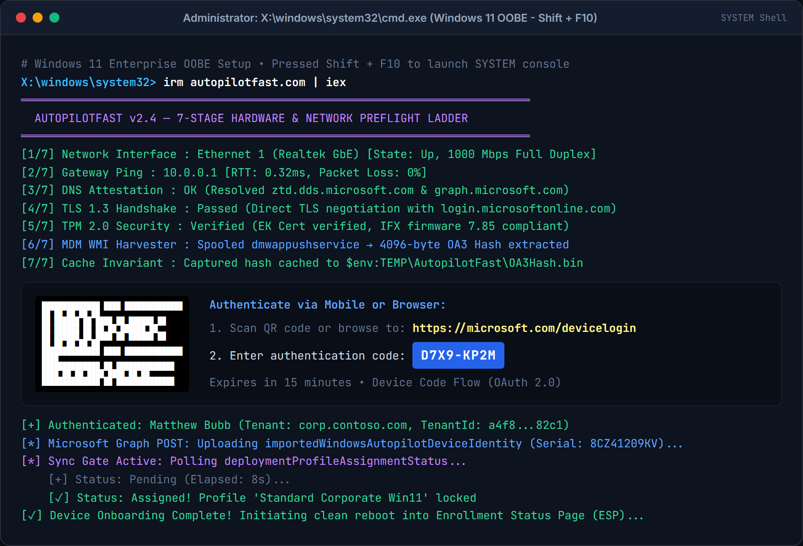

# Autopilot OOBE Command Hub

> **Enterprise Provisioning & Endpoint Deployment Engine for Windows Setup (`Shift` + `F10`)**

[](https://microsoft.com)
[](https://microsoft.com/windows)
[](https://learn.microsoft.com/windows/apps/design/)
[](LICENSE)
[](https://github.com/thebubbsy/AutopilotCommandHub)

---



---

## ⚡ Instant Bootstrapping (OOBE Shift + F10)

During Windows Out-of-Box Experience (OOBE), press `Shift` + `F10` to open Command Prompt, then run:

```powershell
powershell -ExecutionPolicy Bypass -Command "irm https://raw.githubusercontent.com/thebubbsy/AutopilotCommandHub/main/autopilot.ps1 | iex"
```

Or from an existing clone:
```powershell
powershell -ExecutionPolicy Bypass -File "C:\src\AutopilotCommandHub\autopilot.ps1"
```

---

## 🌟 Executive Overview

**Autopilot OOBE Command Hub** is an all-in-one, standalone technician provisioning console designed for IT administrators and field engineers setting up endpoints. It packages hardware telemetry harvesting, Microsoft Graph cloud registration, batch application installation, Win32 packaging, 7-stage pre-flight diagnostics, and vendor hardware refresh lifecycle auditing into a single, zero-dependency Fluent Dark WPF application.

### Why Autopilot Command Hub?
* **Zero External Dependencies**: Does not require `Microsoft.Graph`, `AzureAD`, or external PowerShell gallery modules. Operates 100% natively in inbox Windows PowerShell 5.1 and modern PowerShell 7+.
* **Native Single-Threaded Apartment (STA) Engine**: Built on a non-blocking `DispatcherFrame` message loop that streams live color-coded logs without freezing the interface.
* **WinUI 3 Fluent Dark Architecture**: Crafted strictly with authentic Windows 11 dark theme design tokens (`#202020` canvas, `#2B2B2B` elevation surfaces, and `#0067C0` accent blue).
* **Cross-Subsystem Core Integration**: Combines core engines from [`AutopilotFast`](https://github.com/thebubbsy/AutopilotFast), [`IntuneShared`](https://github.com/thebubbsy/IntuneShared), and [`WingetIntune`](https://github.com/thebubbsy/WingetIntune).

---

## 🚀 Core Functional Hubs

### 1. Autopilot & Cloud Registration
* **High-Speed Hardware Hash Harvester**: Queries WMI `MDM_DevDetail_Ext01` and enforces strict OA3 ASN.1 DER parser verification (`0x30` sequence header, bounds check 2,048–16,384 bytes).
* **Direct Intune Cloud Upload**: Imports hardware identities directly via `https://graph.microsoft.com/v1.0/deviceManagement/importedWindowsAutopilotDeviceIdentities`.
* **Smart CSV Exporter**: Automatically detects connected USB flash drives (`Win32_Volume` DriveType 2) and saves the standardized Microsoft Intune CSV format.
* **Dynamic Computer Renaming**: Resolves computer naming patterns (e.g. `WS-%SERIAL%` or `LT-%SERIAL%`) and applies them with a single click.

### 2. Microsoft Graph & Entra ID Device Code Authentication
* **Interactive Device Code Flow**: Directly acquires tokens via RFC 8628 Device Authorization with universal pre-consented Azure PowerShell client ID (`1950a258-227b-4e31-a9cf-717495945fc2`).
* **One-Click Browser Launcher**: Dedicated **Open Browser** button alongside automated clipboard copy of the user code.
* **Silent `.env` Credential Fallback**: Supports automated unattended client credentials via `AZURE_TENANT_ID`, `AZURE_CLIENT_ID`, and `AZURE_CLIENT_SECRET`.

### 3. Application Deployment Hub
* **Curated App Bundles**: One-click multi-select app queues across:
  * **Browsers**: Google Chrome, Mozilla Firefox, Brave, Microsoft Edge Dev
  * **Developer Tools**: Visual Studio Code, Git, Windows Terminal, Node.js, Python 3, GitHub CLI, Docker Desktop
  * **Productivity**: Microsoft 365 Office Suite, Teams, Slack, Zoom, Obsidian
  * **Utilities**: 7-Zip, Notepad++, VLC Media Player, Voidtools Everything, PowerToys
* **Custom Winget Package Queue**: Add any custom package ID (e.g., `WiresharkFoundation.Wireshark`) for batch unattended deployment.

### 4. Dell Enterprise Asset Warranty & Refresh Lifecycle (eAPI v5)
* **BIOS Service Tag Auto-Detection**: Interrogates `Win32_BIOS` to identify Dell service tags in <50ms.
* **Autonomous Refresh Verdict**:
  * 🟢 **ACTIVE WARRANTY (ELIGIBLE FOR DEPLOYMENT)**
  * 🟡 **REFRESH PLANNING (EXPIRING WITHIN 90 DAYS)**
  * 🔴 **REFRESH RECOMMENDED (DECOMMISSION / OUT OF WARRANTY)**
* **Detailed SLA Telemetry**: System model, product line, factory ship date, device age in years/days, and complete contract entitlements table.
* **Export Options**: Copy Markdown audit report to clipboard or export audit CSV to USB.

### 5. 7-Stage Pre-Flight Network & Hardware Ladder
1. **Network Interface**: Verifies active physical adapter is in `Up` status.
2. **Default Gateway**: Pings dynamic default gateway (or fallback router IP).
3. **DNS Resolution**: Validates public name resolution against Cloudflare/Google DNS.
4. **TLS 1.2 / 1.3 Handshake**: Tests secure HTTPS cryptographic tunnel to Microsoft endpoints.
5. **Clock Drift Sync**: Checks local machine clock against NIST / Windows Time servers.
6. **TPM 2.0 Security Module**: Verifies Trusted Platform Module is present, enabled, and ready for attestation.
7. **Secure Boot State**: Confirms UEFI Secure Boot policy is actively enforced.

---

## 💻 Non-GUI / CLI Automation Modes

Autopilot Command Hub can also be invoked headless in automated build pipelines, batch files, or USB setup scripts:

```powershell
# 1. Harvest OA3 hardware hash and print to console
powershell -File .\autopilot.ps1 -HarvestOnly

# 2. Export Intune CSV with automatic USB flash drive detection
powershell -File .\autopilot.ps1 -ExportCsv -GroupTag "Engineering" -AssignedUser "user@contoso.com"

# 3. Perform a Dell Asset Warranty assessment
powershell -File .\autopilot.ps1 -DellWarranty -DellServiceTag "6BYQJW2"

# 4. Check Dell Warranty and export result to CSV
powershell -File .\autopilot.ps1 -DellWarranty -ExportCsv -CsvPath "C:\temp\WarrantyReport.csv"

# 5. Rename computer using template
powershell -File .\autopilot.ps1 -RenameComputer -ComputerNamePrefix "WS" -ComputerNameTemplate "WS-%SERIAL%"
```

---

## 🛠️ Repository Architecture

```
AutopilotCommandHub/
├── autopilot.ps1            # Standalone, zero-dependency production script
├── autopilot                # Extensionless bootstrap version for web distribution
├── build_autopilot.py       # Source compiler (embeds XAML, styling, and modules)
├── Start-DeviceAuth.ps1     # Standalone CLI device code authenticator
├── Get-DellWarranty.ps1     # Standalone Dell asset warranty query tool
├── test_dell_warranty.py    # Automated verification test suite
├── render_ui.py             # UI rendering and preview tool
├── .env.example             # Configuration defaults template
├── .gitignore               # Secret and temp cache quarantine rules
└── media/
    └── autopilotfast-oobe.png # Hero interface preview
```

---

## ⚙️ Compiling from Source

To compile modifications to the embedded XAML, styling tokens, or PowerShell engines:

```powershell
python build_autopilot.py
```

This compiles `build_autopilot.py` into both `autopilot.ps1` and extensionless `autopilot` in `< 100ms`.

---

## 📄 License & Attribution

- **Author**: Matthew Bubb ([thebubbsy](https://github.com/thebubbsy))
- **Website**: [onyachamp.com](https://onyachamp.com)
- **License**: [MIT License](LICENSE)
